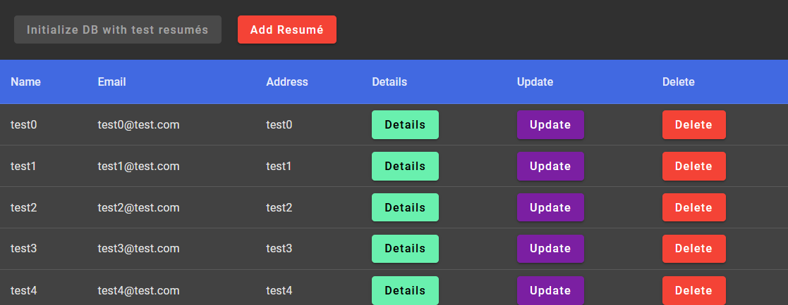

## Assignments

### link to artificial-intelligence branch: https://github.com/SzAndras1/assignments/tree/artificial-intelligence

### link to web-technologies-1 branch: https://github.com/SzAndras1/assignments/tree/web-technologies-1

### link to graphics branch: https://github.com/SzAndras1/assignments/tree/graphics

# Semesterproject - Önéletrajzok

### Start

1. run mongodb if it is not running automatically
2. `cd .\backend\bin`
3. `npm i`
4. `npm start`
5. `cd ..`
6. `cd .\frontend\`
7. `npm i`
8. `ng serve`

### MongoDB stuck

Mongodb URI bezavarhat a db-operations.js-ben, ezért `localhost:27017` vagy `0.0.0.0:27017`-ra kell állítani,
ha `node.js` nem válaszol.

### Regisztrálás

A kezdőoldalon regisztrálni csak olyan felhasználónévvel lehet, ami még nincs regisztrálva. Ha mégis ezzel
próbálkoznánk, akkor egy
400-as státusz kóddal visszatér kérés és megjelenik az alábbi szöveg.

Felhasználói felületen is van validáció.

### Bejelentkezés

Sikeres regisztráció után megjelenik az előbbi komponens. Ha simán csak átnavigálnánk a `login` oldalra, akkor nem
jelenik meg a sikeres beregisztrálás szöveg. Ezt a navigálás során az `extras.state` segítségével csináltam. A
bejelentkezés kérést megnézi a backend, hogy tényleg ugyanazok a autentikációs adatok. Ha nem, akkor az alábbi szöveg
jelenik meg.

### Listázás

Sikeres bejelentkezés után egy üres tábla jelenik meg. Ezt a táblát fel lehet tölteni manuálisan vagy az inicializáló
gombbal, ami 5 darab teszt önéletrajzot létrehoz. Az inicializáló gomb inaktíválódik a használat után.

Manuális hozzáadás így néz ki:

Törlés és frissítés:

### Önéletrajz részletei

Details gomb elnavigál az adott önéletrajzhoz. Egyedi útvonalon van, a `localhost:4200/:id` oldalon érhető el. Itt egy
`disabled` űrlapban vannak az önéletrajz adatai.

### canMatchGuard

canMatchGuard függvény biztosítja a routing-nál, hogy csak akkor legyen elérhető a `resume-list` és
a `resume-details` komponensek, ha be vagyunk jelentkezve. Ez Guard a `user-service`-ben található `subjectIsLoggedIn`
`BehaviorSubject` értékét figyeli.
